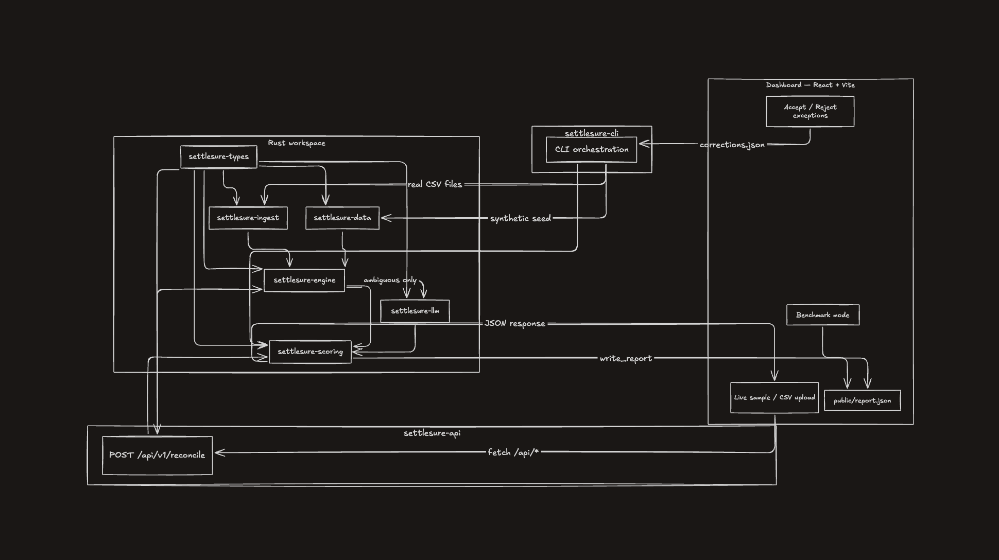

# SettleSure: Watches your settlements and tells you the moment something's wrong

   **Razorpay AI Buildathon: [Track 04: AI Finance Controller](https://razorpay.com/buildathon/)**

**[Live dashboard](https://razopay-three.vercel.app)** · **[Quick start](#quick-start)** · **[Architecture](#architecture)** · **[Public API](#public-api)**

Upload settlement, bank, and payment CSVs or run the adversarial synthetic batch. SettleSure reconciles in milliseconds, surfaces every exception with ₹ at risk, and can **Slack/email you** when something needs attention.

Rules handle **42/49** true matches in **~13 ms** (`--skip-llm`, seed 42). LLM verifies the **7** ambiguous cases rules cannot safely decide.


| Precision | Recall     | FP rate | Exact / Fuzzy / Split / LLM / Human |
| --------- | ---------- | ------- | ----------------------------------- |
| **100%**  | **85.71%** | **0%**  | 23 / 17 / 2 / 0 / 0                 |


Seed 42, 77 payments / 77 settlements / 60 bank credits, `--skip-llm` baseline (no corrections).

### Multi-seed robustness (seeds 42-61, `--skip-llm`, n=20)

| Metric    | Mean    | Std Dev | Min     | Max     |
| --------- | ------- | ------- | ------- | ------- |
| Precision | 100.00% | 0.00%   | 100.00% | 100.00% |
| Recall    | 85.71%  | 0.00%   | 85.71%  | 85.71%  |
| FP rate   | 0.00%   | 0.00%   | 0.00%   | 0.00%   |

Zero variance across these 20 seeds: the hardened generator preserves the same adversarial class layout (7 unresolved ambiguous GT matches per seed). Re-run with `npm run robustness-report`.


| CLI                                   | Dashboard                                       |
| ------------------------------------- | ----------------------------------------------- |
|  |  |


## AI design

LLM is **tier 4**, not tier 1. Clear cases never touch the model.


| Tier                  | Handles                                                      |
| --------------------- | ------------------------------------------------------------ |
| Exact / Fuzzy / Split | Clear + bounded ambiguity (deterministic, sub-ms)            |
| **LLM**               | 7 ambiguous GT matches (near-dup UTR, multi-solution splits) |
| Human                 | Ops override via dashboard                                   |


| Model (seed 42, `--compare-llm`) | Recall w/ LLM | LLM matches |
| -------------------------------- | ------------- | ----------- |
| none (`--skip-llm`)              | 85.71%        | 0           |
| **qwen2.5-coder:7b** (Ollama)    | **100.00%**   | **7**       |
| llama3.2 (Ollama)                | 89.80%        | 2           |


```bash
cargo run -p settlesure-cli -- --seed 42 --compare-llm \
  --llm-provider ollama --llm-model qwen2.5-coder:7b --no-llm-cache --no-banner
# Cloud: OPENAI_API_KEY=... --llm-provider openai --llm-model gpt-4o-mini
```

LLM prefixes: `LLM verdict: match/no_match` | `ambiguous: LLM declined` | `LLM unavailable: provider error` | `ambiguous: LLM unavailable`. Example report: [report-llm.json](dashboard/public/report-llm.json).

## Architecture



3-way reconciliation: Payments → Settlements (gross/fee/tax/net + UTR) → Bank credits.

Pipeline: **integrity → exact → fuzzy → split → LLM → human corrections**

Adversarial generator includes near-duplicate decoys, accept-band fuzzy bait, boundary mangles, and unresolvable noise (`ambiguityLevel`: `clear` / `boundary` / `decoy` / `unresolvable`).   
Full design doc: [docs/ARCHITECTURE.md](docs/ARCHITECTURE.md)

## Quick start

```bash
cargo run -p settlesure-cli -- --seed 42 --skip-llm
npm run reconcile -- --settlement-file fixtures/real/settlements.csv \
  --bank-file fixtures/real/bank.csv --payments-file fixtures/real/payments.csv --skip-llm
npm run sync-report && npm run dashboard   # http://localhost:5173
```

### Options

| Flag                       | Meaning                                                                                                      |
| -------------------------- | ------------------------------------------------------------------------------------------------------------ |
| `--seed <n>`               | Reproducible batch (default `42`)                                                                            |
| `--generate-only`          | Write data files and exit                                                                                    |
| `--skip-llm`               | Force no LLM                                                                                                 |
| `--llm-provider <…>`       | `anthropic` \| `openai` \| `ollama` \| `none`                                                                |
| `--llm-model <name>`       | Model name (Ollama default `llama3.2`, OpenAI default `gpt-4o-mini`)                                         |
| `--llm-base-url <url>`     | OpenAI-compatible API root                                                                                   |
| `--apply-corrections`      | Apply `output/corrections.json` or `data/demo_corrections.json`                                              |
| `--runs <n>`               | Multi-seed robustness (seeds `seed..seed+n-1`)                                                               |
| `--compare-llm`            | Side-by-side LLM on vs off ablation                                                                          |
| `--no-llm-cache`           | Disable `output/llm-cache.json` (fresh model calls)                                                          |
| `--batch-scale <n>`        | Multiply adversarial class counts (default `1`)                                                              |
| `--settlement-file <path>` | Settlement CSV (requires `--bank-file` + `--payments-file`)                                                  |
| `--bank-file <path>`       | Bank statement CSV                                                                                           |
| `--payments-file <path>`   | Payment export CSV                                                                                           |
| `--notify`                 | Slack/email alert when exceptions found (`SLACK_WEBHOOK_URL`, optional `RESEND_API_KEY` + `NOTIFY_EMAIL_TO`) |

Provider selection: `--llm-provider` → `ANTHROPIC_API_KEY` → `OPENAI_API_KEY` → Ollama → none.

**Alerting:** `SLACK_WEBHOOK_URL=... npm run reconcile:notify` (optional `RESEND_API_KEY` + `NOTIFY_EMAIL_TO` for email).

**BYOK:** OpenAI/Groq/OpenRouter via `OPENAI_API_KEY` + `--llm-base-url`; Anthropic via `npm run ablation-anthropic`.

## Release gates

Non-overridable constants in code:


| Tier  | Auto-release rule                                                  |
| ----- | ------------------------------------------------------------------ |
| Exact | UTR + amount + date exact match                                    |
| Fuzzy | Score ≥ 0.75, exact amount, ≥ 0.08 margin over runner-up           |
| Split | Unique subset-sum only; multi-solution → human/LLM                 |
| LLM   | Never alone: UTR similarity ≥ 0.85 **and** amount within tolerance |


## Public API

```bash
npm run api   # local: http://localhost:3000
curl https://settlesure-api.onrender.com/api/health

export API_KEY='hNBdpF/dOTk+470+j+uUGMrG22cjZ6DpsGJI4io1eCE='
curl -X POST https://settlesure-api.onrender.com/api/v1/reconcile \
  -H "Content-Type: application/json" -H "X-API-Key: $API_KEY" \
  -H "Idempotency-Key: demo-batch-001" -d @examples/request.json
```

Public judge-demo key (not a production secret). Auth via `X-API-Key` (401 if missing). Max **20,000** records (413 above). Idempotency-Key cached 24h. OpenAPI: `GET /openapi.json`. Live dashboard proxies `/api/*` server-side.

## Performance & ops


| Scale | Records (pay/setl/bank) | Runtime | Throughput |
| ----- | ----------------------- | ------- | ---------- |
| 1×    | 77 / 77 / 60            | 1.8 ms  | 74,538/s   |
| 10×   | 770 / 770 / 600         | 218 ms  | 6,269/s    |
| 50×   | 3,850 / 3,850 / 3,000   | 3.8 s   | 1,793/s    |


```bash
cargo test --workspace && cargo clippy --all-targets --all-features -- -D warnings && npm run sync-report
docker build -t settlesure . && docker run --rm settlesure --seed 42 --skip-llm --no-banner
```

CI rejects suspiciously perfect seed 42 (100%/100%/0% with no LLM/human tier) or missing adversarial GT slices. Exception accuracy ~71% under `--skip-llm` is expected (7 ambiguous GT rows inflate the denominator).

## Limitations & security

- Dates: `YYYY-MM-DD`, `DD/MM/YYYY`, `DD-MM-YYYY` only. No FX. Split pool ≤100, combo ≤8.
- `--skip-llm` intentionally under-matches ambiguous GT rows. LLM ablation is model-dependent.
- `settlesure-engine` has zero LLM dependency; UTRs in bank/settlement fields never reach a model.
- LLM prompts wrap match data in `<untrusted_data>` tags; output must be `match` / `no_match` / `unsure` or falls back to exception.
- Prompt injection tests: `crates/settlesure-llm/tests/prompt_injection.rs`.

## References

- [Razorpay AI Buildathon](https://razorpay.com/buildathon/)
- [Architecture and crate boundaries](docs/ARCHITECTURE.md)
- [Committed seed 42 baseline](baselines/seed42.json)
- [Example API request](examples/request.json)
- [Live API health check](https://settlesure-api.onrender.com/api/health)

## License

[MIT License](LICENSE) © 2026 SettleSure.
