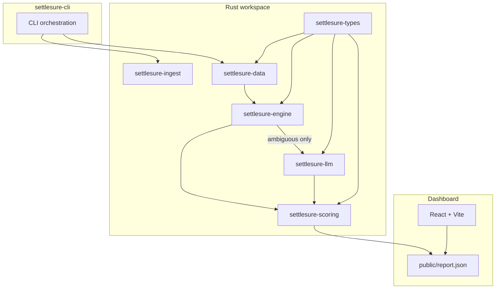

<p align="center">
  
</p>

# SettleSure: Watches your settlements and tells you the moment something's wrong

**Razorpay AI Buildathon, [Track 04: AI Finance Controller](https://razorpay.com/buildathon/)**


Upload real settlement, bank, and payment CSVs — or run the adversarial synthetic batch. SettleSure reconciles in milliseconds, surfaces every exception with ₹ at risk, and can **Slack/email you** the moment something needs attention.

Rules handle **42/49** true matches in **~13 ms** on the synthetic benchmark. LLM verifies the **7** genuinely ambiguous cases rules cannot safely decide.

| Precision | Recall | FP rate | Exact / Fuzzy / Split / LLM / Human |
| ---: | ---: | ---: | ---: |
| **100%** | **85.71%** | **0%** | 23 / 17 / 2 / 0 / 0 |

Seed 42, 77 payments / 77 settlements / 60 bank credits, `--skip-llm` baseline (no corrections).

### Multi-seed robustness (seeds 42–61, `--skip-llm`, n=20)

| Metric | Mean | Std Dev | Min | Max |
| --- | ---: | ---: | ---: | ---: |
| Precision | 100.00% | 0.00% | 100.00% | 100.00% |
| Recall | 85.71% | 0.00% | 85.71% | 85.71% |
| FP rate | 0.00% | 0.00% | 0.00% | 0.00% |

Zero variance across these 20 seeds: the hardened generator preserves the same adversarial class layout (7 unresolved ambiguous GT matches per seed). Re-run with `npm run robustness-report`.

| CLI | Dashboard |
| --- | --- |
|  |  |

## 60-second demo

```bash
npm run sync-report    # regenerate baseline + copy to dashboard/public/report.json
npm run dashboard      # http://localhost:5173
```

1. **Real files:** upload settlement + bank + payment CSVs in the dashboard, or `npm run reconcile:fixtures`.
2. **Synthetic benchmark:** `cargo run -p settlesure-cli -- --seed 42 --skip-llm` runs exact, fuzzy, and split passes.
3. **Alerting:** `SLACK_WEBHOOK_URL=... npm run reconcile:notify` fires when exceptions are found.
4. **Human loop (separate demo):** Accept an exception, then Re-run with corrections. Do **not** use this run for headline metrics.

## Engineering judgment

We caught and fixed results that looked good but weren't:

1. **Suspicious perfect score.** 100%/100%/0% with zero LLM/human meant the adversarial batch no longer exercised fallback tiers. Generator hardened so `--skip-llm` leaves 7 ambiguous GT matches unresolved.
2. **Transport errors mislabeled.** Connection failures showed as `"ambiguous — LLM error"`. Split into explicit `provider error` vs `declined (unsure)`.
3. **Docker stub binary.** Container shipped wrong binary. Fixed in Dockerfile.
4. **Synthetic-only ingestion.** Competitors ingested real files; we only generated data. Added `settlesure-ingest` with messy CSV normalization (₹ symbols, `DD/MM/YYYY`, leading-zero UTRs).
5. **Split pool too small for real batches.** Pool was capped at 25 with arbitrary truncation. Raised to 100 with amount-bucketing (top-40 search window) so realistic batches stay tractable.
6. **Uncorroborated auto-release.** LLM and narrow-margin fuzzy matches could auto-release without independent signals. Added non-overridable release gates (margin + UTR corroboration).

## AI design: verifier, not matcher

LLM is **tier 4**, not tier 1. Clear cases never touch the model.

| Tier | Handles | Why not LLM? |
| --- | --- | --- |
| Exact / Fuzzy / Split | Clear + bounded ambiguity | Deterministic, auditable, sub-ms |
| **LLM** | 7 ambiguous GT matches (near-dup UTR, multi-solution splits) | Only place rules can't safely decide |
| Human | Ops override via dashboard | Bounded escalation with audit trail |

### Model sensitivity (seed 42, `--compare-llm`)

| Model | Recall w/ LLM | LLM matches | Verdicts (match / no_match / declined) |
| --- | ---: | ---: | --- |
| none (`--skip-llm`) | 85.71% | 0 | n/a |
| **qwen2.5-coder:7b** (Ollama) | **100.00%** | **7** | 7 / 0 / 2 |
| llama3.2 (Ollama, measured 2026-08-30) | 89.80% | 2 | 2 / 3 / 5 |
| gpt-4o-mini (OpenAI BYOK) | re-measure with key | n/a | n/a |
| qwen2.5:7b | 85.71% | 0 | 0 / 7 / 2 |

qwen2.5-coder measured 2026-08-27. llama3.2 re-measured 2026-08-30 on hardened generator. Model choice matters. Weak models show zero recall lift.

```bash
# Primary local demo (Ollama, best recall lift)
cargo run -p settlesure-cli -- --seed 42 --compare-llm \
  --llm-provider ollama --llm-model qwen2.5-coder:7b --no-llm-cache --no-banner

# Cloud BYOK fallback
OPENAI_API_KEY=... cargo run -p settlesure-cli -- --seed 42 --compare-llm \
  --llm-provider openai --llm-model gpt-4o-mini --no-banner
# or: npm run ablation-openai
```

When `--compare-llm` runs with a reachable provider, the report includes `llmAblation` and a `verdictLog` audit trail. Committed example: [`dashboard/public/report-llm.json`](dashboard/public/report-llm.json) (llama3.2, 2026-08-30). Sample entry:

```json
{
  "candidateId": "bank_0036:setl_0036",
  "verdict": "match",
  "reasoning": "UTR similarity 0.87",
  "latencyMs": 77340.067
}
```

### LLM exception prefixes (failure-class distinction)

| Prefix | Meaning |
| --- | --- |
| `LLM verdict: match` / `no_match` | Model responded with a clear verdict |
| `ambiguous — LLM declined` | Model responded but unsure / low confidence |
| `LLM unavailable — provider error` | Transport/HTTP failure after one retry |
| `ambiguous — LLM unavailable` | Provider not selected / Ollama unreachable |

Copy ablation output for dashboard LLM panel: `cp output/report.json dashboard/public/report-llm.json` (committed sample uses llama3.2).

## Architecture



Pipeline: **integrity → exact → fuzzy → split → LLM → human corrections**

Full design doc: [`docs/ARCHITECTURE.md`](docs/ARCHITECTURE.md)

## Pipeline

Razorpay-style 3-way settlement reconciliation: Payments → Settlements (gross/fee/tax/net + UTR) → Bank payout credits.

Adversarial cases include near-duplicate decoys, **accept-band precision bait** (decoys engineered to cross the 0.75 fuzzy threshold), boundary reference mangles, decoy subset sums, and unresolvable noise. Scored with `ambiguityLevel` (`clear` / `boundary` / `decoy` / `unresolvable`).

## Quick start

```bash
cargo run -p settlesure-cli -- --seed 42 --skip-llm
# Real CSV files (all three required):
npm run reconcile -- --settlement-file ./fixtures/real/settlements.csv \
  --bank-file ./fixtures/real/bank.csv --payments-file ./fixtures/real/payments.csv --skip-llm
npm run sync-report   # baseline + dashboard artifact + check-baseline
npm run dashboard     # http://localhost:5173 — upload CSVs in UI
```

### Options

| Flag | Meaning |
| --- | --- |
| `--seed <n>` | Reproducible batch (default `42`) |
| `--generate-only` | Write data files and exit |
| `--skip-llm` | Force no LLM |
| `--llm-provider <…>` | `anthropic` \| `openai` \| `ollama` \| `none` |
| `--llm-model <name>` | Model name (Ollama default `llama3.2`, OpenAI default `gpt-4o-mini`) |
| `--llm-base-url <url>` | OpenAI-compatible API root |
| `--apply-corrections` | Apply `output/corrections.json` or `data/demo_corrections.json` |
| `--runs <n>` | Multi-seed robustness (seeds `seed..seed+n-1`) |
| `--compare-llm` | Side-by-side LLM on vs off ablation |
| `--no-llm-cache` | Disable `output/llm-cache.json` (fresh model calls) |
| `--batch-scale <n>` | Multiply adversarial class counts (default `1`) |
| `--settlement-file <path>` | Settlement CSV (requires `--bank-file` + `--payments-file`) |
| `--bank-file <path>` | Bank statement CSV |
| `--payments-file <path>` | Payment export CSV |
| `--notify` | Slack/email alert when exceptions found (`SLACK_WEBHOOK_URL`, optional `RESEND_API_KEY` + `NOTIFY_EMAIL_TO`) |

Provider selection: `--llm-provider` → `ANTHROPIC_API_KEY` → `OPENAI_API_KEY` → Ollama → none.

### Alerting

```bash
export SLACK_WEBHOOK_URL=https://hooks.slack.com/services/...
export DASHBOARD_URL=http://localhost:5173   # optional, included in message
npm run reconcile:notify

# Email digest (stretch):
export RESEND_API_KEY=re_...
export NOTIFY_EMAIL_TO=ops@example.com
npm run reconcile -- --seed 42 --skip-llm --notify
```

### BYOK (bring your own key)

| Provider | Env | `--llm-base-url` | Example `--llm-model` |
| --- | --- | --- | --- |
| OpenAI | `OPENAI_API_KEY` | (default) | `gpt-4o-mini` |
| Groq | `OPENAI_API_KEY` | `https://api.groq.com/openai/v1` | `llama-3.1-8b-instant` |
| OpenRouter | `OPENAI_API_KEY` | `https://openrouter.ai/api/v1` | `openai/gpt-4o-mini` |

Anthropic: `npm run ablation-anthropic` when `ANTHROPIC_API_KEY` is set.

## Throughput (Rust release, deterministic passes)

Measured 2026-08-30 with `cargo run --release -p settlesure-cli -- --seed 42 --batch-scale N --skip-llm`.

| Scale | Records (pay / setl / bank) | Runtime (ms) | Throughput (rec/s) |
| --- | --- | ---: | ---: |
| 1× | 77 / 77 / 60 | 1.8 | 74,538 |
| 10× | 770 / 770 / 600 | 218.5 | 6,269 |
| 50× | 3,850 / 3,850 / 3,000 | 3,820.6 | 1,793 |

Fuzzy pass dominates at scale. Amount × date bucketing reduces pairwise comparisons.

## Public API (judge-testable)

Deploy the Rust API to Render (`render.yaml`) or run locally:

```bash
npm run api          # http://localhost:3000
npm run api:build    # release binary
```

### Health check

```bash
curl https://settlesure-api.onrender.com/api/health
# → { "status": "ok", "version": "2.0.0" }
```

### Reconcile

```bash
export API_KEY='hNBdpF/dOTk+470+j+uUGMrG22cjZ6DpsGJI4io1eCE='
curl -X POST https://settlesure-api.onrender.com/api/v1/reconcile \
  -H "Content-Type: application/json" \
  -H "X-API-Key: $API_KEY" \
  -H "Idempotency-Key: demo-batch-001" \
  -d @examples/request.json
```

- **Auth:** `X-API-Key` is required. The key above is an intentionally public, size-limited judge-demo credential, not a production secret. Missing/invalid keys return `401`.
- **Size cap:** batches over **20,000** total records (payments + settlements + bank transactions) return `413`.
- **Idempotency:** repeat requests with the same `Idempotency-Key` return the cached report (24h TTL).
- **Contract:** `GET /openapi.json` for OpenAPI 3.0 spec.

Vercel dashboard deploy can proxy `/api/*` to the Rust backend via `SETTLESURE_API_URL` (see `api/` folder).

## Release gates (non-overridable)

Auto-release safety floors are **constants in code**, not CLI-configurable:

| Tier | Auto-release rule |
| --- | --- |
| Exact | UTR + amount + date exact match |
| Fuzzy | Score ≥ 0.75 **and** exact amount **and** ≥ 0.08 margin over runner-up |
| Split | Unique subset-sum only; multi-solution → human/LLM |
| LLM | Never alone — requires UTR similarity ≥ 0.85 **and** amount within tolerance |

Truncated or mangled UTRs may still confuse weak LLM models, but **wrong LLM verdicts no longer auto-release** — they route to human review via the corroboration gate.

## Docker

```bash
docker build -t settlesure .
docker run --rm settlesure --seed 42 --skip-llm --no-banner
docker compose up engine      # writes output/report.json
docker compose up dashboard   # http://localhost:5173
```

**Container notes.** Ollama runs on the host, not inside the container. Dashboard `/api/rerun` requires a local Rust toolchain (dev convenience).

## Metrics (never blended)

Overall precision, recall, and FP rate are reported separately, plus **Accuracy by case difficulty** in `output/report.md` and the dashboard.

**Exception accuracy** = correctly flagged exceptions ÷ predicted exception count. Under `--skip-llm`, the 7 deliberately-unresolved ambiguous GT matches produce `ambiguous — LLM unavailable` rows that inflate the denominator. **~71%** at seed 42. With LLM enabled those cases resolve to matches. Expected, not a regression.

## Tests & CI

```bash
cargo test --workspace
cargo clippy --all-targets --all-features -- -D warnings
npm run sync-report
```

CI fails if seed 42 is suspiciously perfect (100%/100%/0% with zero LLM/human tier usage) or if adversarial GT slices disappear.


## History

| Era | Precision / Recall | Exact / Fuzzy / Split | Notes |
| --- | --- | --- | --- |
| Pre-fix TS | 97.67% / 91.30% | 22 / 18 / 3 | Dup-UTR false splits |
| Fixed TS | 100% / 100% | 22 / 22 / 2 | Dup-UTR gate + prefix floor 0.92 |
| Rust port | 100% / 100% | 22 / 22 / 2 | Parity with fixed TS |
| **Hardened generator (current)** | **100% / 85.71%** | **23 / 17 / 2** | Accept-band decoy bait + LLM-tier cases |

## Known limitations

- Truncated/mangled UTRs: LLM may still misclassify, but release gates block uncorroborated auto-release
- Real CSV dates: `YYYY-MM-DD`, `DD/MM/YYYY`, `DD-MM-YYYY` only (US `MM/DD/YYYY` not supported)
- Split matching: amount-bucketed subset-sum (pool ≤100, search cap 40, combo ≤8)
- Ambiguous multi-solution batches routed to LLM/human, not auto-picked
- No FX conversion
- Ollama residual nondeterminism possible (model/hardware)
- `--skip-llm` intentionally under-matches ambiguous GT rows
- LLM ablation numbers are model-dependent. Re-measure per provider.

## Security

- **Deterministic core:** `settlesure-engine` has no dependency on `settlesure-llm` and no code path that invokes it. Exact, fuzzy, and split matching cannot be influenced by adversarial strings in bank UTRs or settlement references — those fields are never sent to a model.
- **LLM tier input:** All match-relevant data in LLM prompts (UTRs, IDs, reasoning strings, split options) is wrapped in `<untrusted_data>...</untrusted_data>` tags, with an explicit system-level instruction to treat tagged content as data only, never as instructions.
- **LLM tier output:** Model responses are parsed against a fixed verdict vocabulary (`match`, `no_match`, `unsure`). Any other value, malformed JSON, or non-JSON response falls back to `unsure` (declined/exception), not a trusted match.
- **Tests:** `crates/settlesure-llm/tests/prompt_injection.rs` covers untrusted-field delimiting, adversarial UTR injection with mocked provider responses, and malformed output rejection.
- **Not covered:** A fully compromised model that returns valid `{"verdict":"match",...}` JSON is accepted by the parser — mitigating that would require cross-checks beyond current scope.
