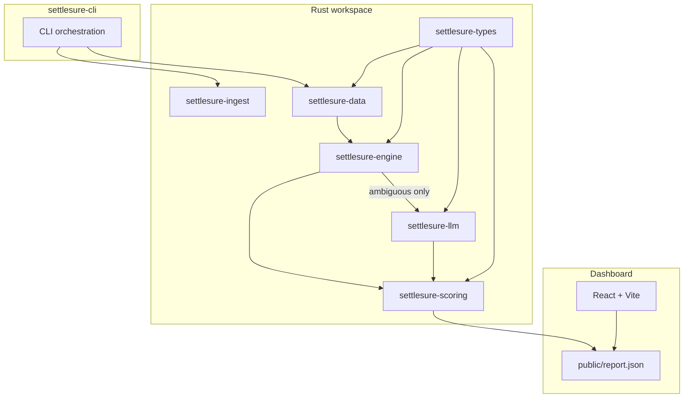

<p align="center">
  
</p>

<h3 align="center">Watches your settlements and tells you the moment something's wrong</h3>

<p align="center">
  <a href="https://razopay-three.vercel.app"><strong>Live demo</strong></a>
  &nbsp;•&nbsp;
  <a href="docs/ARCHITECTURE.md">Architecture</a>
  &nbsp;•&nbsp;
  <a href="https://razorpay.com/buildathon/">Razorpay Buildathon — Track 04</a>
</p>

<p align="center">
  <a href="https://github.com/Annieeeee11/SettleSure/actions/workflows/ci.yml"></a>
  
  
  
</p>

<p align="center">
  Upload real settlement, bank, and payment CSVs — or run the adversarial synthetic batch.<br/>
  SettleSure reconciles in milliseconds, surfaces every exception with ₹ at risk,<br/>
  and can <strong>Slack/email you</strong> the moment something needs attention.
</p>

<br/>

## Reconcile faster with no blind spots

SettleSure is a Rust-first 3-way settlement reconciler for Razorpay-style payment flows. Rules handle the clear cases in sub-millisecond time; LLM verifies only the genuinely ambiguous ones.

- **Run deterministic passes first** — exact, fuzzy, and split matching resolve 42/49 true matches in ~13 ms
- **Zero false positives on the benchmark** — 100% precision with hardened adversarial decoys
- **LLM as verifier, not matcher** — only 7 ambiguous cases per seed need model review
- **Real CSV ingestion** — messy formats normalized (₹ symbols, `DD/MM/YYYY`, leading-zero UTRs)
- **Non-overridable release gates** — uncorroborated LLM or fuzzy matches never auto-release
- **Ops-ready alerting** — Slack/email the moment exceptions need human attention

Rules handle the volume. LLM handles the edge cases. Humans handle the rest.

## Features

| | |
|:--|:--|
| **Deterministic engine** | Exact → fuzzy → split pipeline with amount × date bucketing. Auditable, sub-ms on clear matches. [Architecture →](docs/ARCHITECTURE.md) |  |
| **LLM verifier tier** | Model reviews only ambiguous candidates — near-dup UTRs, multi-solution splits, accept-band decoys. Never tier 1. | |
| **Real CSV ingestion** | Upload settlement, bank, and payment exports. Browser-side parsing; API key stays server-side on the live demo. |  |
| **Ops dashboard** | Match rate, precision/recall, difficulty slices, exception list with Accept/Reject, LLM ablation panel. | |
| **Slack & email alerts** | Fire notifications when exceptions are found. Optional Resend email digest. | |
| **Public HTTP API** | `POST /api/v1/reconcile` with auth, idempotency, and OpenAPI spec. Deployed on Render. | |
| **Release gates** | Margin floors, UTR corroboration, and unique subset-sum checks — constants in code, not CLI flags. | |
| **Adversarial benchmark** | Seeded generator with decoy bait, boundary mangles, and unresolvable noise. CI guards against fake-perfect scores. | |

**Also in the box:**

- **Multi-seed robustness** — `npm run robustness-report` across seeds 42–61
- **LLM ablation** — `--compare-llm` side-by-side with verdict audit trail
- **Human corrections loop** — Accept/Reject exceptions in the dashboard, re-run with `--apply-corrections`
- **Docker** — engine + dashboard via `docker compose`
- **Prompt injection tests** — untrusted-field delimiting and malformed output rejection
- **BYOK providers** — Ollama, OpenAI, Anthropic, Groq, OpenRouter

## Benchmark (seed 42, `--skip-llm`)

| Precision | Recall | FP rate | Exact / Fuzzy / Split / LLM / Human |
| ---: | ---: | ---: | ---: |
| **100%** | **85.71%** | **0%** | 23 / 17 / 2 / 0 / 0 |

Seed 42, 77 payments / 77 settlements / 60 bank credits. No corrections applied.

### Multi-seed robustness (seeds 42–61, n=20)

| Metric | Mean | Std Dev | Min | Max |
| --- | ---: | ---: | ---: | ---: |
| Precision | 100.00% | 0.00% | 100.00% | 100.00% |
| Recall | 85.71% | 0.00% | 85.71% | 85.71% |
| FP rate | 0.00% | 0.00% | 0.00% | 0.00% |

Zero variance: the hardened generator preserves 7 unresolved ambiguous GT matches per seed. Re-run with `npm run robustness-report`.

## Live demo

Open **[razopay-three.vercel.app](https://razopay-three.vercel.app)** and click **Run live sample**.

The browser calls a same-origin Vercel proxy, which injects the API key server-side and sends the batch to the Rust API on Render. Results appear in the dashboard with match sources, confidence, exceptions, and release-gate limitations.

You can also upload settlement, bank, and payment CSVs. Parsing happens in the browser; the API key never ships to client JavaScript. Render's free tier may take up to a minute to wake after inactivity.

## Quick start

```bash
npm run sync-report    # regenerate benchmark report
npm run api            # terminal 1: http://localhost:3000
npm run dashboard      # terminal 2: http://localhost:5173
```

**Synthetic benchmark:**

```bash
cargo run -p settlesure-cli -- --seed 42 --skip-llm
```

**Real CSV files (all three required):**

```bash
npm run reconcile -- --settlement-file ./fixtures/real/settlements.csv \
  --bank-file ./fixtures/real/bank.csv \
  --payments-file ./fixtures/real/payments.csv --skip-llm
```

**Alerting:**

```bash
SLACK_WEBHOOK_URL=... npm run reconcile:notify
```

### CLI options

| Flag | Meaning |
| --- | --- |
| `--seed <n>` | Reproducible batch (default `42`) |
| `--generate-only` | Write data files and exit |
| `--skip-llm` | Force no LLM |
| `--llm-provider <…>` | `anthropic` \| `openai` \| `ollama` \| `none` |
| `--llm-model <name>` | Model name (Ollama default `llama3.2`, OpenAI default `gpt-4o-mini`) |
| `--llm-base-url <url>` | OpenAI-compatible API root |
| `--apply-corrections` | Apply `output/corrections.json` or `data/demo_corrections.json` |
| `--runs <n>` | Multi-seed robustness (seeds `seed..seed+n-1`) |
| `--compare-llm` | Side-by-side LLM on vs off ablation |
| `--no-llm-cache` | Disable `output/llm-cache.json` (fresh model calls) |
| `--batch-scale <n>` | Multiply adversarial class counts (default `1`) |
| `--settlement-file <path>` | Settlement CSV (requires `--bank-file` + `--payments-file`) |
| `--bank-file <path>` | Bank statement CSV |
| `--payments-file <path>` | Payment export CSV |
| `--notify` | Slack/email alert when exceptions found |

Provider selection: `--llm-provider` → `ANTHROPIC_API_KEY` → `OPENAI_API_KEY` → Ollama → none.

## AI design: verifier, not matcher

LLM is **tier 4**, not tier 1. Clear cases never touch the model.

| Tier | Handles | Why not LLM? |
| --- | --- | --- |
| Exact / Fuzzy / Split | Clear + bounded ambiguity | Deterministic, auditable, sub-ms |
| **LLM** | 7 ambiguous GT matches (near-dup UTR, multi-solution splits) | Only place rules can't safely decide |
| Human | Ops override via dashboard | Bounded escalation with audit trail |

Pipeline: **integrity → exact → fuzzy → split → LLM → human corrections**

### Model sensitivity (seed 42, `--compare-llm`)

| Model | Recall w/ LLM | LLM matches | Verdicts (match / no_match / declined) |
| --- | ---: | ---: | --- |
| none (`--skip-llm`) | 85.71% | 0 | n/a |
| **qwen2.5-coder:7b** (Ollama) | **100.00%** | **7** | 7 / 0 / 2 |
| llama3.2 (Ollama) | 89.80% | 2 | 2 / 3 / 5 |
| gpt-4o-mini (OpenAI BYOK) | re-measure with key | n/a | n/a |

```bash
# Primary local demo (Ollama, best recall lift)
cargo run -p settlesure-cli -- --seed 42 --compare-llm \
  --llm-provider ollama --llm-model qwen2.5-coder:7b --no-llm-cache --no-banner

# Cloud BYOK fallback
OPENAI_API_KEY=... cargo run -p settlesure-cli -- --seed 42 --compare-llm \
  --llm-provider openai --llm-model gpt-4o-mini --no-banner
```

When `--compare-llm` runs with a reachable provider, the report includes `llmAblation` and a `verdictLog` audit trail. Committed example: [`dashboard/public/report-llm.json`](dashboard/public/report-llm.json).

## Architecture



Full design doc: [`docs/ARCHITECTURE.md`](docs/ARCHITECTURE.md)

## Public API

Deploy the Rust API to Render (`render.yaml`) or run locally:

```bash
npm run api          # http://localhost:3000
npm run api:build    # release binary
```

**Health check:**

```bash
curl https://settlesure-api.onrender.com/api/health
# → { "status": "ok", "version": "2.0.0" }
```

**Reconcile:**

```bash
export API_KEY='hNBdpF/dOTk+470+j+uUGMrG22cjZ6DpsGJI4io1eCE='
curl -X POST https://settlesure-api.onrender.com/api/v1/reconcile \
  -H "Content-Type: application/json" \
  -H "X-API-Key: $API_KEY" \
  -H "Idempotency-Key: demo-batch-001" \
  -d @examples/request.json
```

| | |
|:--|:--|
| **Auth** | `X-API-Key` required. The key above is a public judge-demo credential, not a production secret. |
| **Size cap** | Batches over **20,000** total records return `413`. |
| **Idempotency** | Same `Idempotency-Key` returns cached report (24h TTL). |
| **Contract** | `GET /openapi.json` for OpenAPI 3.0 spec. |

## Release gates

Auto-release safety floors are **constants in code**, not CLI-configurable:

| Tier | Auto-release rule |
| --- | --- |
| Exact | UTR + amount + date exact match |
| Fuzzy | Score ≥ 0.75 **and** exact amount **and** ≥ 0.08 margin over runner-up |
| Split | Unique subset-sum only; multi-solution → human/LLM |
| LLM | Never alone — requires UTR similarity ≥ 0.85 **and** amount within tolerance |

## Throughput

Measured with `cargo run --release -p settlesure-cli -- --seed 42 --batch-scale N --skip-llm`.

| Scale | Records (pay / setl / bank) | Runtime (ms) | Throughput (rec/s) |
| --- | --- | ---: | ---: |
| 1× | 77 / 77 / 60 | 1.8 | 74,538 |
| 10× | 770 / 770 / 600 | 218.5 | 6,269 |
| 50× | 3,850 / 3,850 / 3,000 | 3,820.6 | 1,793 |

## Development

```bash
git clone https://github.com/Annieeeee11/SettleSure.git
cd SettleSure

cargo run -p settlesure-cli -- --seed 42 --skip-llm
npm run sync-report
npm run dashboard     # http://localhost:5173
```

**Tests & CI:**

```bash
cargo test --workspace
cargo clippy --all-targets --all-features -- -D warnings
npm run sync-report
```

CI fails if seed 42 is suspiciously perfect (100%/100%/0% with zero LLM/human tier usage) or if adversarial GT slices disappear.

**Docker:**

```bash
docker build -t settlesure .
docker run --rm settlesure --seed 42 --skip-llm --no-banner
docker compose up engine      # writes output/report.json
docker compose up dashboard   # http://localhost:5173
```

## Tech stack

<p align="left">
  
  
  
  
  
  
  
  
</p>

## Engineering judgment

We caught and fixed results that looked good but weren't:

1. **Suspicious perfect score** — 100%/100%/0% meant the adversarial batch no longer exercised fallback tiers. Generator hardened so `--skip-llm` leaves 7 ambiguous GT matches unresolved.
2. **Transport errors mislabeled** — Connection failures showed as `"ambiguous — LLM error"`. Split into explicit `provider error` vs `declined (unsure)`.
3. **Docker stub binary** — Container shipped wrong binary. Fixed in Dockerfile.
4. **Synthetic-only ingestion** — Added `settlesure-ingest` with messy CSV normalization.
5. **Split pool too small** — Raised to 100 with amount-bucketing (top-40 search window).
6. **Uncorroborated auto-release** — Added non-overridable release gates (margin + UTR corroboration).

## Security

- **Deterministic core:** `settlesure-engine` has no dependency on `settlesure-llm`. Exact, fuzzy, and split matching cannot be influenced by adversarial strings in UTRs.
- **LLM tier input:** Match-relevant data is wrapped in `<untrusted_data>...</untrusted_data>` tags with explicit system instructions.
- **LLM tier output:** Responses parsed against fixed verdict vocabulary (`match`, `no_match`, `unsure`). Malformed output falls back to declined/exception.
- **Tests:** `crates/settlesure-llm/tests/prompt_injection.rs` covers untrusted-field delimiting and adversarial UTR injection.

## Known limitations

- Truncated/mangled UTRs: LLM may misclassify, but release gates block uncorroborated auto-release
- Real CSV dates: `YYYY-MM-DD`, `DD/MM/YYYY`, `DD-MM-YYYY` only (US `MM/DD/YYYY` not supported)
- Split matching: amount-bucketed subset-sum (pool ≤100, search cap 40, combo ≤8)
- No FX conversion
- Ollama residual nondeterminism possible (model/hardware)
- `--skip-llm` intentionally under-matches ambiguous GT rows

## History

| Era | Precision / Recall | Exact / Fuzzy / Split | Notes |
| --- | --- | --- | --- |
| Pre-fix TS | 97.67% / 91.30% | 22 / 18 / 3 | Dup-UTR false splits |
| Fixed TS | 100% / 100% | 22 / 22 / 2 | Dup-UTR gate + prefix floor 0.92 |
| Rust port | 100% / 100% | 22 / 22 / 2 | Parity with fixed TS |
| **Hardened generator (current)** | **100% / 85.71%** | **23 / 17 / 2** | Accept-band decoy bait + LLM-tier cases |

## License

MIT — see [Cargo.toml](Cargo.toml).
