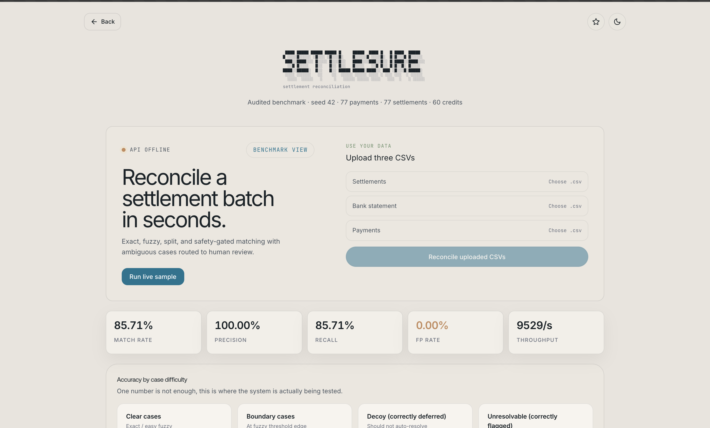

**[Live demo](https://razopay-three.vercel.app)** · **[Open dashboard](https://razopay-three.vercel.app/dashboard)** · **[Golden path](#golden-path-2-min)** · **[Evidence](#evidence-included-in-this-repository)** · **[Public API](#public-api)**

  

A Razorpay payout is not reconciled when it hits your bank. Finance must join payment exports, settlement files, and bank credits by UTR and amount, catch fee/tax drift and duplicate credits, and surface every gap with **₹ at risk**, without silently guessing on ambiguous pairs.

SettleSure is a finance-control workbench for that gap. Upload CSVs or run the adversarial synthetic batch, reconcile in milliseconds, and get a scored exception list with Slack/email alerts when something needs attention.

Built for [Razorpay AI Buildathon 2026, Track 04: AI Finance Controller](https://razorpay.com/buildathon/).

| CLI reconcile | Dashboard metrics |
| --- | --- |
|  | <picture><source media="(prefers-color-scheme: dark)" srcset="dashboard/public/ness/dashboad-dak2.png"></picture> |

## Reconciliation loop

1. **Ingest** settlement, bank, and payment CSVs (or generate a seeded adversarial batch).
2. **Validate integrity:** fee/tax arithmetic, currency consistency, duplicate UTR detection.
3. **Match deterministically:** exact UTR joins, fuzzy near-duplicates, unique subset-sum splits.
4. **Defer ambiguity:** near-dup decoys, boundary UTR mangles, and multi-solution splits never auto-release.
5. **Verify with LLM (optional):** tier 4 only; corroborated UTR similarity + amount tolerance required.
6. **Review in dashboard:** filter exceptions, inspect match reasoning, Accept/Reject for ops override.
7. **Alert and export:** Slack/email on exceptions; JSON/Markdown report; HTTP API for automation.

The money-matching path is deterministic. Models cannot auto-release without passing release gates. LLM never runs on clear exact/fuzzy/split matches.

## Evidence included in this repository

`npm run reconcile -- --seed 42 --skip-llm` runs the Rust engine against the hardened synthetic benchmark (77 payments / 77 settlements / 60 bank credits).


| Result                                        | Included run (`--skip-llm`, seed 42) |
| --------------------------------------------- | ------------------------------------ |
| True matches in ground truth                  | 49                                   |
| Deterministic matches (exact + fuzzy + split) | **42**                               |
| Precision                                     | **100%**                             |
| Recall                                        | **85.71%**                           |
| False positive rate                           | **0%**                               |
| Runtime                                       | **~14 ms**                           |
| Unsafe auto-matches on decoys                 | **0**                                |


| Pass  | Count |
| ----- | ----- |
| Exact | 23    |
| Fuzzy | 17    |
| Split | 2     |
| LLM   | 0     |
| Human | 0     |


The 7 unresolved GT matches are **intentionally ambiguous** (near-dup UTR, multi-solution splits); rules defer rather than guess. With LLM enabled, `qwen2.5-coder:7b` resolves all 7 and reaches **100% recall** on seed 42.

### Multi-seed robustness (seeds 42-61, `--skip-llm`, n=20)


| Metric    | Mean    | Std Dev | Min     | Max     |
| --------- | ------- | ------- | ------- | ------- |
| Precision | 100.00% | 0.00%   | 100.00% | 100.00% |
| Recall    | 85.71%  | 0.00%   | 85.71%  | 85.71%  |
| FP rate   | 0.00%   | 0.00%   | 0.00%   | 0.00%   |


Zero variance across 20 seeds. Re-run with `npm run robustness-report`.

This validates measured match rate and exception handling on labeled synthetic data. It is not extraction-model accuracy, production capacity, or evidence from real merchant settlement books.

**Prototype boundary:** Working harness, not production financial infrastructure. Benchmark is synthetic with ground-truth labels; hosted demo uses a public API key; human corrections are dev-local; LLM ablation is model-dependent. Production still needs multi-tenant auth, durable storage, immutable audit logs, and live-book evaluation. **Not claimed:** live-money deployment, merchant savings, or bank-feed normalization at scale. Baseline: [seed42.json](baselines/seed42.json) · [report.md](output/report.md).

## Golden path (2 min)

**Live:** [Open dashboard](https://razopay-three.vercel.app/dashboard). Seed 42 report is preloaded: **42 matches**, **100% precision**, **49 exceptions**, **~14 ms**.

**1. Clear match (success path).** In **Matches**, open `bank_0001` ↔ `setl_0001`. Exact UTR, net amount, currency, and date; tier 1 exact pass; no LLM call.

**2. Safe block (failure path).** In **Exceptions**, open `bank_0058`. Duplicate bank credit: UTR already settled by `bank_0057`. SettleSure flags the exception and **does not double-match** the credit.

**3. Ambiguous deferral.** In **Exceptions**, open `bank_0049`. Multiple settlement combinations sum to the same credit (`setl_0064+setl_0065` or `setl_0066+setl_0067`). Rules defer with `ambiguous split`; no auto-pick.

Local replay: `cargo run -p settlesure-cli -- --seed 42 --skip-llm && npm run sync-report && npm run dashboard`

Optional LLM: add `--compare-llm --llm-provider ollama --llm-model qwen2.5-coder:7b` → all **7** ambiguous GT matches resolve, **100% recall**, **0% FP**. Asserted in [`reconcile_e2e.rs`](crates/settlesure-integration/tests/reconcile_e2e.rs); CI floors in [`check-baseline.mjs`](scripts/check-baseline.mjs).

## Product walkthrough

**Judge flow (2 min):**

1. [Landing](https://razopay-three.vercel.app) → problem, pipeline, FAQ
2. [Dashboard](https://razopay-three.vercel.app/dashboard) → headline metrics (42 matches, ₹ at risk)
3. **Exceptions** tab → locate `bank_0058` (blocked duplicate), then `bank_0049` (deferred split)
4. **Matches** tab → locate `bank_0001` (exact match reasoning)
5. Upload CSVs in reconcile panel, or POST to [Public API](#public-api)

| Route | What to inspect |
| --- | --- |
| [/dashboard](https://razopay-three.vercel.app/dashboard) | Metrics, exceptions queue, match inspector, CSV upload |
| [API health](https://settlesure-api.onrender.com/api/health) | Hosted reconciliation API |
| [OpenAPI](https://settlesure-api.onrender.com/openapi.json) | Request/response schema |

## AI design

LLM is **tier 4**, not tier 1. Clear cases never touch the model.


| Tier                              | Handles                                                      |
| --------------------------------- | ------------------------------------------------------------ |
| Integrity / Exact / Fuzzy / Split | Clear + bounded ambiguity (deterministic, sub-ms)            |
| **LLM**                           | 7 ambiguous GT matches (near-dup UTR, multi-solution splits) |
| Human                             | Ops override via dashboard                                   |


| Model (seed 42, `--compare-llm`) | Recall w/ LLM | LLM matches |
| -------------------------------- | ------------- | ----------- |
| none (`--skip-llm`)              | 85.71%        | 0           |
| **qwen2.5-coder:7b** (Ollama)    | **100.00%**   | **7**       |
| llama3.2 (Ollama)                | 89.80%        | 2           |


LLM verdict prefixes: `LLM verdict: match/no_match` · `ambiguous: LLM declined` · `LLM unavailable: provider error` · `ambiguous: LLM unavailable`. Example with LLM on: `[dashboard/public/report-llm.json](dashboard/public/report-llm.json)`.

Cloud models: `OPENAI_API_KEY=... --llm-provider openai --llm-model gpt-4o-mini`

## Architecture


3-way reconciliation: **Payments → Settlements** (gross/fee/tax/net + UTR) **→ Bank credits**.

Pipeline: **integrity → exact → fuzzy → split → LLM → human corrections**


| Runtime path                      | Implemented behavior                                                             | Boundary                                                          |
| --------------------------------- | -------------------------------------------------------------------------------- | ----------------------------------------------------------------- |
| Rust engine (`settlesure-engine`) | Exact, fuzzy, split, integrity, zero network, zero LLM dependency               | Deterministic; UTRs in bank/settlement fields never reach a model |
| LLM verifier (`settlesure-llm`)   | Optional tier 4 for ambiguous bucket only; temperature 0; prompt injection tests | Cannot auto-release without release gates                         |
| Dashboard + API                   | Report sync, CSV upload, human corrections, HTTP reconcile                       | Hosted demo uses public judge API key; not production auth        |


Adversarial generator includes near-duplicate decoys, accept-band fuzzy bait, boundary mangles, and unresolvable noise (`ambiguityLevel`: `clear` / `boundary` / `decoy` / `unresolvable`).

Full design doc: `[docs/ARCHITECTURE.md](docs/ARCHITECTURE.md)`

## Run locally

The synthetic benchmark needs no provider credentials.

```bash
cargo run -p settlesure-cli -- --seed 42 --skip-llm
npm run sync-report && npm run dashboard   # http://localhost:5173
```

To reproduce all checks:

```bash
npm test
npm run check-baseline
npm run robustness-report
npm run reconcile:fixtures
npm run bench-throughput
npm run clippy
docker build -t settlesure . && docker run --rm settlesure --seed 42 --skip-llm --no-banner
```

Real CSV reconcile:

```bash
npm run reconcile -- --settlement-file fixtures/real/settlements.csv \
  --bank-file fixtures/real/bank.csv --payments-file fixtures/real/payments.csv --skip-llm
```

**Alerting:** `SLACK_WEBHOOK_URL=... npm run reconcile:notify` (optional `RESEND_API_KEY` + `NOTIFY_EMAIL_TO` for email).

Provider selection: `--llm-provider` → `ANTHROPIC_API_KEY` → `OPENAI_API_KEY` → Ollama → none. **BYOK:** OpenAI/Groq/OpenRouter via `OPENAI_API_KEY` + `--llm-base-url`; Anthropic via `npm run ablation-anthropic`.

### CLI options


| Flag                       | Meaning                                                              |
| -------------------------- | -------------------------------------------------------------------- |
| `--seed <n>`               | Reproducible batch (default `42`)                                    |
| `--generate-only`          | Write data files and exit                                            |
| `--skip-llm`               | Force no LLM                                                         |
| `--llm-provider <…>`       | `anthropic` | `openai` | `ollama` | `none`                           |
| `--llm-model <name>`       | Model name (Ollama default `llama3.2`, OpenAI default `gpt-4o-mini`) |
| `--llm-base-url <url>`     | OpenAI-compatible API root                                           |
| `--apply-corrections`      | Apply `output/corrections.json` or `data/demo_corrections.json`      |
| `--runs <n>`               | Multi-seed robustness (seeds `seed..seed+n-1`)                       |
| `--compare-llm`            | Side-by-side LLM on vs off ablation                                  |
| `--no-llm-cache`           | Disable `output/llm-cache.json` (fresh model calls)                  |
| `--batch-scale <n>`        | Multiply adversarial class counts (default `1`)                      |
| `--settlement-file <path>` | Settlement CSV (requires `--bank-file` + `--payments-file`)          |
| `--bank-file <path>`       | Bank statement CSV                                                   |
| `--payments-file <path>`   | Payment export CSV                                                   |
| `--notify`                 | Slack/email alert when exceptions found                              |


## Security & controls

| Boundary | Control |
| --- | --- |
| Matching | Non-overridable release gates: exact UTR+amount+date → fuzzy (≥0.75, 0.08 margin) → unique split only |
| Integrity | Fee/tax pre-pass before matching; duplicate UTR blocked (first claim wins) |
| LLM | Tier 4 only; `settlesure-engine` has **zero** LLM dep; UTRs never sent to model |
| Verdicts | `<untrusted_data>` prompts; output must be `match` / `no_match` / `unsure` or falls back to exception |
| API | `X-API-Key`, idempotency keys (24h), 20k record cap, OpenAPI spec |
| Ops | Decoys deferred (22/22); human Accept/Reject + corrections audit; Slack/email alerts |
| CI | Rejects suspiciously perfect seed 42 or missing adversarial GT slices |

Additional guards: integer-safe amounts; multi-solution splits never auto-picked; LLM cannot auto-release without UTR similarity ≥0.85 and amount tolerance; [prompt injection tests](crates/settlesure-llm/tests/prompt_injection.rs). Full trust boundaries: [`docs/ARCHITECTURE.md`](docs/ARCHITECTURE.md).

Format limits: dates `YYYY-MM-DD` / `DD/MM/YYYY` / `DD-MM-YYYY`; no FX; split pool ≤100, combo ≤8. `--skip-llm` intentionally leaves 7 ambiguous GT rows unresolved (~71% exception accuracy by design).

## Public API

```bash
npm run api   # local: http://localhost:3000
curl https://settlesure-api.onrender.com/api/health

export API_KEY='hNBdpF/dOTk+470+j+uUGMrG22cjZ6DpsGJI4io1eCE='
curl -X POST https://settlesure-api.onrender.com/api/v1/reconcile \
  -H "Content-Type: application/json" -H "X-API-Key: $API_KEY" \
  -H "Idempotency-Key: demo-batch-001" -d @examples/request.json
```

Public judge-demo key (not a production secret). Auth via `X-API-Key` (401 if missing). Max **20,000** records (413 above). Idempotency-Key cached 24h. OpenAPI: `GET /openapi.json`. Live dashboard proxies `/api/*` server-side.

## Performance


| Scale | Records (pay/setl/bank) | Runtime | Throughput |
| ----- | ----------------------- | ------- | ---------- |
| 1×    | 77 / 77 / 60            | 1.8 ms  | 74,538/s   |
| 10×   | 770 / 770 / 600         | 218 ms  | 6,269/s    |
| 50×   | 3,850 / 3,850 / 3,000   | 3.8 s   | 1,793/s    |


Re-run benchmarks: `npm run bench-throughput`

## Sources

- [Razorpay AI Buildathon](https://razorpay.com/buildathon/)
- [Razorpay settlements overview](https://razorpay.com/docs/payments/settlements/)
- [Razorpay settlement reports](https://razorpay.com/docs/payments/settlements/reports/)
- [Razorpay payment reports](https://razorpay.com/docs/payments/payment-gateway/reports/)
- [Razorpay instant settlements](https://razorpay.com/docs/payments/settlements/instant/)
- [Razorpay settlement verification](https://razorpay.com/docs/payments/settlements/verify/)
- [Architecture and crate boundaries](docs/ARCHITECTURE.md)
- [Dashboard panels and dev API](dashboard/README.md)
- [Seed 42 baseline contract](baselines/seed42.json)
- [Sample reconciliation report](output/report.md)
- [Example API request](examples/request.json)
- [Live dashboard](https://razopay-three.vercel.app/dashboard)
- [Live API health check](https://settlesure-api.onrender.com/api/health)
- [GitHub repository](https://github.com/Annieeeee11/SettleSure)


## License

[MIT License](LICENSE) © 2026 SettleSure.