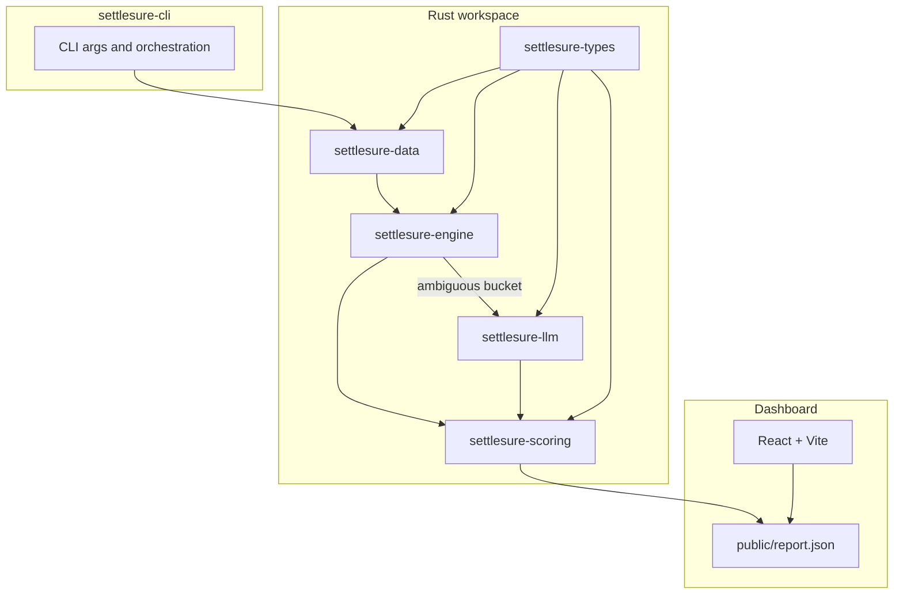
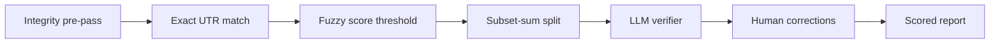

# SettleSure Architecture

SettleSure closes one finance-ops loop: **3-way settlement reconciliation** (Payment → Settlement → Bank credit) with measured match rate, throughput, and an honest exception list.

## System overview

## Reconciliation pipeline

Each batch runs through ordered passes. Earlier passes claim records; later passes only see leftovers.

| Pass | Input | Output |
| --- | --- | --- |
| Integrity | All settlements | Fee/tax mismatches flagged as exceptions |
| Exact | Unmatched bank credits | UTR + amount + date exact joins |
| Fuzzy | Remaining credits | Weighted amount/date/UTR score ≥ 0.75 |
| Split | Remaining credits | Unique subset-sum over settlement pool |
| LLM | Ambiguous bucket only | Structured verdict: match / no_match / unsure |
| Human | Dashboard Accept/Reject | Corrections applied on re-run |

## Design principles

1. **Engine has zero network code** — deterministic matching is sync, unit-testable, and fast (~13 ms at seed 42).
2. **LLM is injected as a callback** — `reconcile(..., resolve_llm)` keeps `settlesure-engine` and `settlesure-llm` independent (no circular deps).
3. **Ground-truth scoring** — synthetic generator labels every row with `ambiguityLevel` so precision/recall are measurable, not vibes.
4. **Honest metrics** — seed 42 intentionally leaves 7 ambiguous GT matches unresolved under `--skip-llm` so fallback tiers are exercised.
5. **Failure-class distinction** — LLM transport errors, model declines, and clear verdicts produce different exception prefixes (audit trail).

## Crate responsibilities

| Crate | Role |
| --- | --- |
| `settlesure-types` | Domain structs, config defaults, report wire format |
| `settlesure-data` | Seeded adversarial generator + ground truth |
| `settlesure-ingest` | Real CSV parsing and normalization (settlement, bank, payment) |
| `settlesure-engine` | Exact, fuzzy, split, integrity, human corrections |
| `settlesure-llm` | Provider selection, retry, cache, verdict log |
| `settlesure-scoring` | Metrics, markdown/JSON reports, terminal output |
| `settlesure-cli` | Args, multi-seed ablation, file I/O |
| `dashboard/` | Reads `report.json`; human Accept/Reject via dev API |

## LLM boundary

The engine builds an **ambiguous candidate list** (near-duplicate UTR pairs, multi-solution splits, accept-band decoys) and hands it to `settlesure-llm`. The LLM crate:

- Selects provider: `--llm-provider` → env keys → Ollama → none
- Calls with `temperature: 0`, JSON schema verdict, 120s timeout + one retry
- Writes `verdict_log` entries (candidate id, verdict, reasoning, latency)
- Never runs on clear exact/fuzzy/split matches

## Human-in-the-loop

Dashboard dev server exposes:

- `GET/POST /api/corrections` — persist Accept/Reject to `output/corrections.json`
- `POST /api/ingest` — upload settlement/bank/payment CSV contents, run CLI, refresh report
- `POST /api/rerun` — re-run CLI with `--apply-corrections`

Human overrides are useful for ops demos but may score as FP when GT says "do not auto-match" — baseline headline metrics always use `--skip-llm` without corrections.

## CI regression guards

`scripts/check-baseline.mjs` enforces seed-42 floors and `forbidSuspiciousPerfect` (blocks 100%/100%/0% with zero LLM/human tier usage). Run `npm run sync-report` to regenerate and copy the dashboard artifact.
